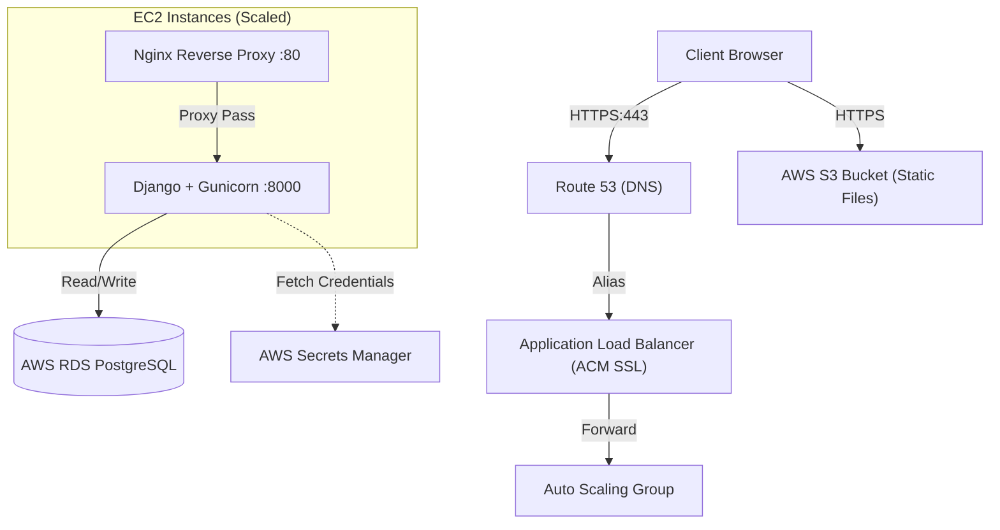
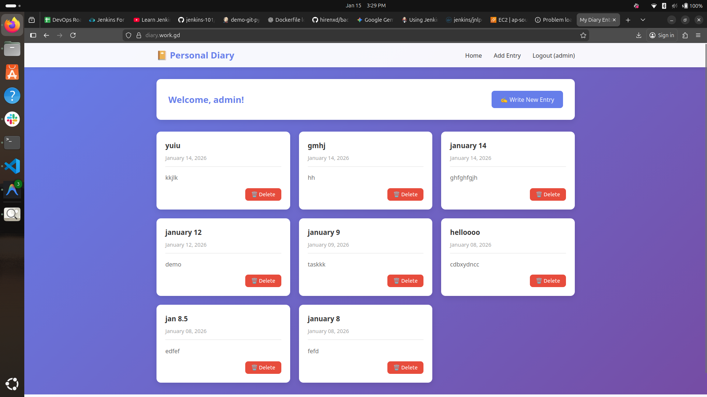
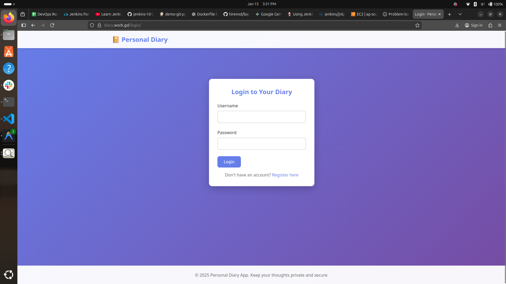
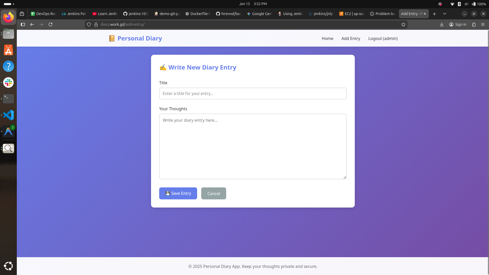
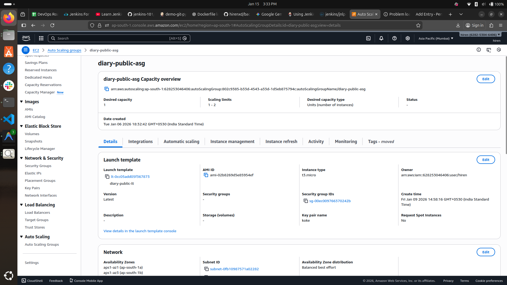

# Django Personal Diary Application


A production-ready personal diary application designed to demonstrate **DevOps best practices** and **Cloud Infrastructure** implementation. This project highlights containerization, reverse proxying, and scalable AWS deployment architectures using modern services like **RDS**, **S3**, and **Secrets Manager**.

> **Note**: This project mimics a real-world setup by using **SQLite** for local development speed, while seamlessly switching to **AWS RDS (PostgreSQL)** and **S3** in production.

**Live Demo URL:** `https://diary.work.gd`

## 📖 Table of Contents
- [Architecture](#-architecture)
- [Key Features](#-key-features)
- [Project Structure](#-project-structure)
- [Local Development](#-local-development)
  - [Docker Setup (Recommended)](#docker-setup-recommended)
  - [Manual Setup](#manual-setup)
- [Production Deployment (AWS)](#-production-deployment-aws)
  - [Infrastructure Components](#infrastructure-components)
  - [Deployment Steps](#deployment-steps)
  - [Health Checks & Auto Scaling](#health-checks--auto-scaling)
- [Screenshots](#-screenshots)

## 🏗 Architecture

The application demonstrates a 3-tier architecture on AWS, secured with SSL:



### Infrastructure decisions:
- **Route 53**: Manages the domain `diary.work.gd` and routes traffic to the ALB.
- **ACM (Certificate Manager)**: Provisions and manages the SSL public certificate for secure HTTPS communication.
- **ALB (Application Load Balancer)**: Terminates SSL and distributes traffic across instances.
- **Docker Compose**: Orchestrates the Nginx and Django containers.
- **Nginx**: Acts as the reverse proxy inside the container.
- **Auto Scaling**: Dynamically adjusts the number of EC2 instances based on CPU utilization.
- **RDS**: Managed PostgreSQL instance.
- **S3**: Offloads static assets.
- **Secrets Manager**: Securely stores database credentials.

## ✨ Key Features
- **Secure Access**: Full HTTPS support via Route 53 and ACM.
- **DevOps**: Dockerized stack, creating a consistent environment from dev to prod.
- **AWS Integration**: Production-ready setup with User Data scripts.
- **Scalability & Resilience**: ASG for scaling and RDS for data persistence.
- **Application**: Secure user authentication and diary management.

## 📂 Project Structure

```text
Django-personal-diary-app/
├── diary/                  # Application business logic
├── diary_project/          # Django project settings
├── docs/                   # Documentation assets & Screenshots
├── nginx/                  # Nginx configuration
│   └── nginx.conf
├── Dockerfile              # Django application container definition
├── docker-compose.yml      # Service orchestration
├── entrypoint.sh           # Container entrypoint script
├── manage.py               # Django management script
└── requirements.txt        # Python dependencies
```

## 💻 Local Development

### Docker Setup (Recommended)
Pre-requisites: **Docker** and **Docker Compose**.

1. **Clone the repository**:
   ```bash
   git clone <repository-url>
   cd Django-personal-diary-app
   ```

2. **Build and Run**:
   ```bash
   docker compose up -d --build
   ```

3. **Access the Application**:
   - Open browser at `http://localhost`

### Manual Setup
Pre-requisites: **Python 3.10+** and **virturalenv**.

1. **Create Virtual Environment**:
   ```bash
   python -m venv venv
   source venv/bin/activate  # On Windows: venv\Scripts\activate
   ```

2. **Install Dependencies**:
   ```bash
   pip install -r requirements.txt
   ```

3. **Migrate Database (SQLite)**:
   ```bash
   python manage.py makemigrations
   python manage.py migrate
   ```

4. **Run Server**:
   ```bash
   python manage.py runserver
   ```
   - Access at `http://127.0.0.1:8000`

## ☁ Production Deployment (AWS)

### Infrastructure Components
- **Domain**: `diary.work.gd` managed by **Route 53**.
- **SSL**: **AWS ACM** certificate attached to the Load Balancer.
- **EC2**: Ubuntu 22.04+ Instances in an Auto Scaling Group.
- **RDS**: PostgreSQL engine.
- **S3 Bucket**: Static files.
- **Secrets Manager**: DB Credentials.
- **IAM Role**: Requires permissions for:
  - `AmazonEC2ContainerRegistryReadOnly`
  - `CloudWatchAgentServerPolicy`
  - `SecretsManagerReadWrite`
  - `AmazonS3ReadOnlyAccess` (for instances to potentially access S3 if needed, though usually public/presigned).

### Deployment Steps
The **User Data** script configures the instance on launch:

```bash
#!/bin/bash
set -eux

# 1. Install Docker & Docker Compose
apt-get update -y
apt-get install -y docker.io docker-compose-v2
systemctl enable docker && systemctl start docker
usermod -aG docker ubuntu

# 2. Configure Environment
# - Fetch Secrets from Secrets Manager
# - Configure Django to use S3 for STATIC_URL

# 3. Deploy Application
cd /home/ubuntu
# git clone <repo_url>
docker compose up -d
```

### Health Checks & Auto Scaling
- **ALB Health Check**: Path `/health`, Success `200`.
- **Auto Scaling**: Target Tracking on CPU Utilization (Target: 70%).

## 📸 Screenshots


| Home Page | Login Page |
|:---:|:---:|
|  |  |

| Add Entry | Auto Scaling |
|:---:|:---:|
|  |  |
